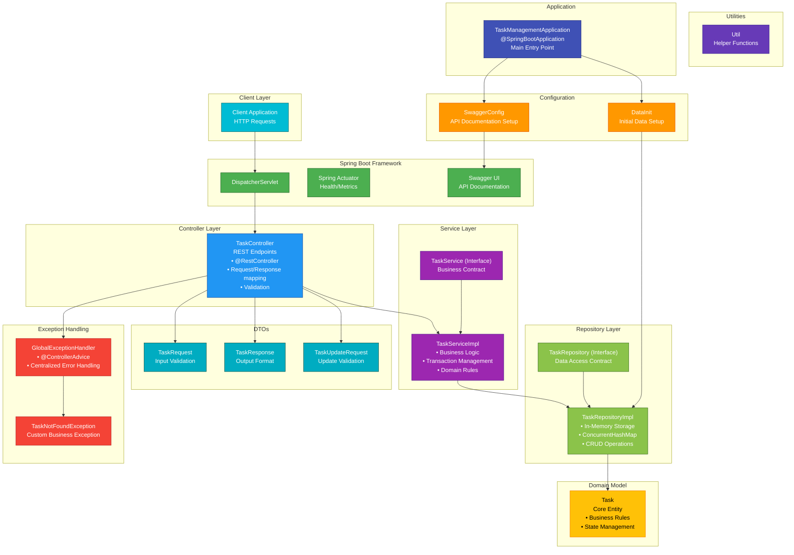

# Task Manager API 🚀


A robust **Spring Boot** REST API for task management with full CRUD operations, built with modern best practices.

## Features ✨

- **Complete Task Management**:
    - Create, read, update, and delete tasks
    - Filter by status (`PENDING`, `COMPLETED`, `FAILED`, `IN_PROGRESS`)
    - Filter by priority (`HIGH`, `MEDIUM`, `LOW`)
    - Partial updates with `PATCH`

- **Modern Architecture**:
    - Clean layered design (Controller → Service → Repository)
    - Proper DTO separation
    - Comprehensive validation
    - Global exception handling

- **Production Ready**:
    - Docker containerization
    - Health checks via Actuator
    - Full API documentation (Swagger UI)
    - Proper HTTP status codes

## Tech Stack 💻

| Component           | Technology |
|---------------------|----------|
| Framework           | Spring Boot 3.x |
| Language            | Java 21 LTS |
| Build Tool          | Maven    |
| Containerization    | Docker   |
| API Documentation   | Swagger/OpenAPI 3 |
| Testing             | JUnit 5  |

## Getting Started 🏁

### Prerequisites

- Java 21 LTS
- Maven 3.8+
- Docker (optional)

### Installation

1. Clone the repository:
   ```bash
   git clone https://github.com/thenoblet/task-manager.git
   cd task-manager
   ```

2. Build the project:
   ```bash
   mvn clean package
   ```

3. Run the application:
   ```bash
   java -jar target/task-management-*.jar
   ```

### Docker Setup

```bash
# Build the image
docker build -t task-manager .

# Run the container
docker run -p 8080:8080 task-manager
```

## API Documentation 📚

Interactive API documentation is available at:
```
http://localhost:8080/swagger-ui.html
```


## API Endpoints 🌐

| Method | Endpoint                | Description                     |
|--------|-------------------------|---------------------------------|
| GET    | `/api/v1/tasks`         | Get all tasks                   |
| GET    | `/api/v1/tasks/{id}`    | Get a specific task             |
| POST   | `/api/v1/tasks`         | Create a new task               |
| PUT    | `/api/v1/tasks/{id}`    | Fully update a task             |
| PATCH  | `/api/v1/tasks/{id}`    | Partially update a task         |
| DELETE | `/api/v1/tasks/{id}`    | Delete a task                   |
| GET    | `/api/v1/tasks/status/{status}` | Filter tasks by status      |
| GET    | `/api/v1/tasks/priority/{priority}` | Filter by priority     |

## Example Requests 💡

**Create a Task:**
```bash
curl -X POST -H "Content-Type: application/json" \
  -d '{
    "title": "Complete project",
    "description": "Finish the API documentation",
    "priority": "HIGH",
    "status": "IN_PROGRESS",
    "dueDate": "2023-12-31T23:59:59Z",
    "tags": ["documentation", "urgent"]
  }' \
  http://localhost:8080/api/v1/tasks
```

**Get Tasks by Status:**
```bash
curl http://localhost:8080/api/v1/tasks/status/IN_PROGRESS
```

## Project Structure 🗂️

```
task-manager-api/
├── src/
│   ├── main/
│   │   ├── java/gtp/taskmanagement/
│   │   │   ├── config/          # Configuration classes
│   │   │   ├── controller/      # REST controllers
│   │   │   ├── dto/             # Data Transfer Objects
│   │   │   ├── exception/       # Custom exceptions
│   │   │   ├── model/           # Domain models
│   │   │   ├── repository/      # Data access
│   │   │   └── service/         # Business logic
│   │   └── resources/           # Properties files
│   └── test/                    # Unit tests
├── docs/                        # Documentation
├── Dockerfile                   # Docker configuration
└── pom.xml                      # Maven dependencies
```

## Component Diagram 📊

## Best Practices ✅

- **Inversion of Control** through Spring DI
- **Layered architecture** for separation of concerns
- **Immutable DTOs** for API contracts
- **Proper HTTP semantics** (status codes, methods)
- **Comprehensive validation** on all inputs
- **Containerization** for consistent deployments
